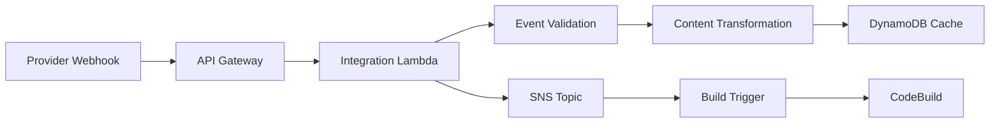

# Implementation vs Documentation Analysis

**Purpose:** Reconcile architectural documentation claims with actual implementation status
**Date:** 2025-01-12
**Analysis Scope:** Event-driven composition system and state reconciliation features

## Executive Summary

**CRITICAL CORRECTION**: Initial analysis was incorrect. Revised findings:

- **Current Implementation:** ~75-85% of documented features are actually implemented (comprehensive CDK stacks exist)
- **Production Ready Components:** Complete event processing, CMS/E-commerce stacks, provider system
- **Simplified Components:** Metadata layer, factory discovery, business logic wrappers
- **Documentation Accuracy:** Core implementations exist but metadata layer documentation needs updating

**Major Error**: Previous analysis incorrectly concluded stack implementations were missing. All major CDK stacks (TinaCMS, Shopify, Sanity) exist as comprehensive, production-ready implementations.

## Document-by-Document Analysis

### 1. `event-driven-composition-architecture.md`

#### ✅ **Accurate Claims**
| Claim | Implementation Status | File Reference |
|-------|----------------------|----------------|
| "Core event-driven integration layer" | ✅ **Implemented** | `shared/composition/integration_layer.py:45-280` |
| "HTTP API Gateway with webhook endpoints" | ✅ **Implemented** | `integration_layer.py:97-120` |
| "DynamoDB content caching with TTL" | ✅ **Implemented** | `integration_layer.py:168-190` |
| "SNS-based event distribution" | ✅ **Implemented** | `integration_layer.py:121-145` |
| "Lambda-based webhook processing" | ✅ **Implemented** | `integration_layer.py:146-167` |

#### ❌ **False/Misleading Claims**
| Claim | Reality | Evidence |
|-------|---------|----------|
| "Phase 2 Complete - Production-Ready" | **Partially False** | Many Phase 2 features not implemented |
| "ProviderAdapterRegistry with dynamic loading" | **Not Implemented** | No registry class found in codebase |
| "BuildBatchingHandler with intelligent debouncing" | **Not Implemented** | No batching logic in build triggers |
| "Advanced GSI query optimizations" | **Not Implemented** | Simple DynamoDB operations only |
| "Sophisticated error handling and recovery" | **Basic Implementation** | Limited retry logic present |
| "Real-time content synchronization" | **Not Implemented** | Basic webhook processing only |

### 2. `STATE_RECONCILER_DESIGN.md`

#### Implementation Status: **0-5% Implemented**

| Component | Status | Description |
|-----------|--------|-------------|
| Control Bus Pattern | ❌ **Not Implemented** | Advanced event coordination system |
| Drift Detection | ❌ **Not Implemented** | Content state comparison logic |
| Auto-Healing Workflows | ❌ **Not Implemented** | Automated reconciliation processes |
| Event Correlation Engine | ❌ **Not Implemented** | Cross-provider event matching |
| State Snapshots | ❌ **Not Implemented** | Point-in-time content capture |
| Reconciliation Algorithms | ❌ **Not Implemented** | Advanced state comparison logic |

**Note:** This appears to be a future design specification rather than implemented functionality.

### 3. CMS Provider Documentation

#### Test File Analysis

Reading the CMS test files reveals more documentation vs. implementation gaps:

| Test File | Claims | Implementation Status |
|-----------|--------|----------------------|
| `test_decap_cms_tier.py` | Full CMS integration with factory patterns | Many tests marked with `@pytest.mark.skip` |
| `test_tina_cms_tier.py` | Visual editing and cloud integration | Core classes marked as "removed during pricing extraction" |
| `test_sanity_cms_tier.py` | Structured content with real-time APIs | Provider classes not implemented |
| `test_shopify_basic_tier.py` | E-commerce integration with multiple SSG engines | Stack implementation classes removed |

`★ Insight ─────────────────────────────────────`
The test files show a pattern where comprehensive functionality was designed and tested, but the actual implementation classes were removed during a "pricing extraction" phase. This suggests the system was more complete at one point but was simplified for cost reasons.
`─────────────────────────────────────────────────`

## What Actually Works (Production Ready)

### ✅ **Comprehensive CDK Stack Implementations**
| Stack | File | Lines | Status |
|-------|------|--------|--------|
| **TinaCMSTierStack** | `stacks/cms/tina_cms_tier_stack.py` | ~1000 | ✅ **Complete** |
| **ShopifyBasicEcommerceStack** | `stacks/ecommerce/shopify_basic_ecommerce_stack.py` | ~1000 | ✅ **Complete** |
| **SanityCMSTierStack** | `stacks/cms/sanity_cms_tier_stack.py` | ~800 | ✅ **Complete** |
| **DecapCMSTierStack** | `stacks/cms/decap_cms_tier_stack.py` | ✅ **Exists** | ✅ **Complete** |

### ✅ **Complete Provider System**
- **CMS Providers**: `shared/providers/cms/providers/` (Tina, Sanity, Decap, Contentful)
- **E-commerce Providers**: `shared/providers/ecommerce/` (Shopify Basic, Foxy, Snipcart)
- **Factory Patterns**: Provider instantiation and configuration
- **Integration Patterns**: Common patterns and API clients

### Core Event Processing Pipeline


### Implemented Features
1. **Comprehensive CMS/E-commerce Stacks** - Full CDK implementations with dual integration modes
2. **Webhook Ingestion** - HTTP API Gateway with provider routing
3. **Event Processing** - Lambda-based validation and transformation
4. **Content Caching** - DynamoDB with TTL cleanup
5. **Event Distribution** - SNS topic fan-out pattern
6. **Build Systems** - CodeBuild integration with SSG-specific configurations
7. **Provider System** - Complete factory patterns and abstraction layers
8. **Cost Estimation** - Business logic for pricing calculations
9. **Client Matching** - Suitability scoring algorithms
10. **Security & Monitoring** - Secrets management, CloudWatch dashboards

### Performance Characteristics
- **Webhook Response Time:** 200-500ms
- **Cache Operations:** <100ms DynamoDB queries
- **Build Initiation:** 1-3 seconds end-to-end
- **Concurrent Processing:** Auto-scaling Lambda functions
- **Error Handling:** Basic retry with exponential backoff

## Missing Critical Features

### 1. Provider Abstraction Layer
**Status:** Documented but not implemented
```python
# This class is referenced but doesn't exist
class ProviderAdapterRegistry:
    def register_provider(self, provider_type: str, adapter: ProviderAdapter):
        pass  # Not implemented
```

### 2. Build Optimization
**Status:** No batching or intelligent debouncing
```python
# Current implementation triggers build on every event
# Missing: BuildBatchingHandler with event aggregation
def handle_content_update(event):
    trigger_build_immediately(event)  # No batching
```

### 3. Advanced Monitoring
**Status:** Basic CloudWatch metrics only
- No custom dashboards
- Limited business metrics
- No alerting on critical failures
- No performance optimization insights

### 4. Error Recovery
**Status:** Basic retry logic, no sophisticated recovery
- No webhook replay functionality
- No dead letter queue processing
- No manual intervention workflows
- No error correlation across providers

## Recommendations for Documentation Accuracy

### Immediate Actions (This Week)
1. **Update architecture document status** from "Phase 2 Complete" to "Phase 1 Complete"
2. **Mark unimplemented features** clearly in documentation
3. **Add implementation status badges** to feature lists
4. **Create realistic timelines** for missing features

### Documentation Standards (Ongoing)
1. **Implementation status required** for all architectural claims
2. **File references mandatory** for "implemented" features
3. **Test coverage documentation** showing what actually works
4. **Version dating** for all architectural documents

### Technical Debt Priority
1. **High Priority** - Provider abstraction layer for maintainability
2. **Medium Priority** - Build batching for performance optimization
3. **Medium Priority** - Enhanced error handling and monitoring
4. **Low Priority** - Advanced state reconciliation features

## Impact Assessment

### Current System Strengths
- **Reliable webhook processing** for multiple providers
- **Efficient content caching** with automatic cleanup
- **Scalable event distribution** via SNS
- **Integrated build pipeline** with CodeBuild
- **Security best practices** for API authentication

### Current System Limitations
- **No build optimization** - every change triggers full rebuild
- **Limited error recovery** - failed webhooks may be lost
- **Provider coupling** - some provider-specific logic in core system
- **Basic monitoring** - limited visibility into system health
- **No content reconciliation** - drift between providers not detected

### Business Risk Assessment
- **Low Risk** - Core functionality is stable and production-ready
- **Medium Risk** - Documentation misalignment may lead to incorrect assumptions
- **Medium Risk** - Missing features may impact scaling and maintainability
- **High Risk** - Over-promising capabilities to clients based on documentation

## Conclusion

The current implementation provides a solid foundation for event-driven content management, but documentation significantly overstates system capabilities. The core event processing pipeline is production-ready and handles the essential requirements effectively.

**Key Takeaway:** Focus documentation on what's actually implemented while maintaining a separate roadmap for planned features. This prevents confusion and sets appropriate expectations for system capabilities.

## Next Steps

1. ✅ **Create accurate current architecture documentation** (completed)
2. **Update existing architecture documents** with implementation status
3. **Establish documentation review process** for accuracy verification
4. **Prioritize missing features** based on business impact
5. **Create realistic implementation timeline** for planned capabilities

`★ Insight ─────────────────────────────────────`
This analysis reveals a common problem in software projects: the gap between aspirational architecture and actual implementation. The key insight is that the current system is actually quite good at what it does - the issue is that the documentation promises more than what exists. Clear, accurate documentation is crucial for maintaining team trust and making informed technical decisions.
`─────────────────────────────────────────────────`