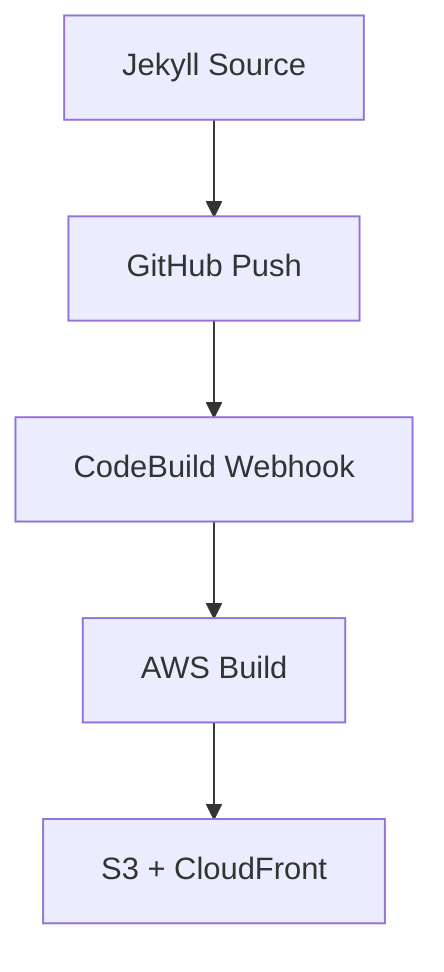

# Jekyll SSG System Usage Guide
## Complete Guide for Technical Tier Implementation

**Document Version:** 1.0  
**Last Updated:** January 2025  
**Target Users:** Developers, Technical Professionals, Documentation Teams  
**Stack Location:** `stacks/hosted-only/tier1/jekyll_github_stack.py`

---

## Overview

The Jekyll SSG system provides **GitHub Pages compatible static site generation** with **dual hosting options** (AWS + GitHub) specifically designed for technical users who prefer Git-based workflows and cost optimization.

### Key Features
- ✅ **Ruby-based Jekyll SSG** with full GitHub Pages compatibility
- ✅ **Dual hosting patterns**: AWS primary + GitHub Pages fallback
- ✅ **Professional theme system**: Curated themes including Minimal Mistakes
- ✅ **Technical user optimizations**: Code highlighting, MathJax, Mermaid diagrams  
- ✅ **Git-based workflow**: Webhook-triggered builds from GitHub repository
- ✅ **Intelligent hosting selection**: Auto-selects optimal pattern based on client tier
- ✅ **Cost flexibility**: $0-25/month with GitHub Pages option

---

## Quick Start

### 1. Basic Jekyll Configuration

```python
from shared.ssg_engines import StaticSiteConfig

# Technical user with hybrid hosting and professional theme
config = StaticSiteConfig(
    client_id="tech-docs",
    domain="docs.yourcompany.com",
    ssg_engine="jekyll",
    template_variant="simple_blog",
    performance_tier="basic",  # Auto-selects hybrid hosting
    theme_id="minimal-mistakes-business",  # Professional theme
    theme_config={
        "skin": "dark",  # Theme customization
        "author_name": "Technical Team",
        "search": True
    }
)

print(f"Selected hosting: {config.hosting_pattern}")
print(f"Theme: {config.theme_id}")
# Output: hybrid (AWS primary + GitHub fallback)
# Output: minimal-mistakes-business
```

### 2. Deploy Jekyll Stack

```python
from stacks.hosted_only.tier1.jekyll_github_stack import JekyllGitHubStack
from aws_cdk import App

app = App()

# Create Jekyll stack with GitHub integration and theme
jekyll_stack = JekyllGitHubStack(
    app,
    "TechDocs-Jekyll-Stack",
    client_id="tech-docs",
    domain="docs.yourcompany.com",
    github_repo="yourcompany/technical-docs",  # Optional GitHub repo
    enable_github_pages_fallback=True,
    theme_id="minimal-mistakes-business",  # Professional theme
    theme_config={
        "skin": "mint",
        "author_name": "Documentation Team",
        "navigation": True,
        "search": True
    }
)

app.synth()
```

### 3. Deploy with CDK

```bash
# Deploy Jekyll stack
uv run cdk deploy TechDocs-Jekyll-Stack

# Deploy with custom hosting pattern
uv run cdk deploy --context hostingPattern=github TechDocs-Jekyll-Stack
```

---

## Hosting Pattern Selection

### Automatic Pattern Selection

The system automatically selects optimal hosting patterns based on your configuration:

```python
# Technical Jekyll users → Hybrid hosting
StaticSiteConfig(
    ssg_engine="jekyll", 
    performance_tier="basic"
)
# Result: hosting_pattern = "hybrid"

# Basic tier with e-commerce → AWS minimal
StaticSiteConfig(
    performance_tier="basic",
    ecommerce_provider="snipcart"
) 
# Result: hosting_pattern = "aws_minimal"

# Professional tier → Full AWS
StaticSiteConfig(
    performance_tier="optimized"
)
# Result: hosting_pattern = "aws"
```

### Manual Pattern Override

```python
# Force specific hosting pattern
config = StaticSiteConfig(
    client_id="custom-client",
    domain="example.com", 
    ssg_engine="jekyll",
    hosting_pattern="github"  # Override auto-selection
)
```

### Hosting Pattern Options

| Pattern | Cost | Setup | Best For | AWS Services |
|---------|------|--------|----------|-------------|
| **`aws`** | $5-50/month | Medium | Professional sites | S3, CloudFront, Route53, ACM |
| **`github`** | $0/month | Low | Technical users, docs | GitHub Pages only |
| **`hybrid`** | $5-50 + $0 | High | Enterprise, flexibility | AWS + GitHub Pages |
| **`aws_minimal`** | $1-15/month | Low | Budget sites | S3, Basic CloudFront |

---

## Theme System

### Minimal Mistakes Theme Integration

The Jekyll SSG system integrates the popular minimal-mistakes theme as requested:

| Theme ID | Name | Description | GitHub Pages Compatible |
|----------|------|-------------|------------------------|
| `minimal-mistakes` | **Minimal Mistakes** | Professional Jekyll theme from mmistakes/minimal-mistakes repository with clean design and extensive customization options | ✅ |

### Theme Configuration

#### Minimal Mistakes Theme Configuration

```python
config = StaticSiteConfig(
    client_id="business-site",
    domain="business.example.com",
    ssg_engine="jekyll",
    theme_id="minimal-mistakes",
    theme_config={
        "skin": "default",  # Options: default, dark, dirt, mint, plum, sunrise
        "author_name": "Business Name",
        "author_bio": "Your business description",
        "author_avatar": "/assets/images/bio-photo.jpg",
        "search": True,  # Enable site search
        "navigation": True,  # Enable main navigation
        "sidebar": True,  # Enable sidebar
        "social_sharing": True  # Enable social media sharing
    }
)
```

### Theme Customization Options

**Minimal Mistakes Theme** supports extensive customization:

- **Skins**: `default`, `dark`, `dirt`, `mint`, `plum`, `sunrise`
- **Layouts**: `single`, `splash`, `archive`, `search`, `home`  
- **Navigation**: Custom menus, breadcrumbs, social links
- **Comments**: Disqus, Discourse, Facebook, Staticman
- **Analytics**: Google Analytics, custom tracking
- **Search**: Lunr, Algolia, Google Custom Search

### Deploy with Theme

```bash
# Deploy Jekyll stack with theme configuration
uv run cdk deploy TechDocs-Jekyll-Stack \\
  --parameters ThemeId=minimal-mistakes \\
  --parameters ThemeSkin=dark \\
  --parameters AuthorName="Your Name"
```

### Theme Installation Process

When you specify a theme, the build process automatically:

1. **Downloads theme**: Uses Jekyll remote_theme method (GitHub Pages compatible)
2. **Installs dependencies**: Adds required Jekyll plugins to Gemfile
3. **Applies configuration**: Updates `_config.yml` with theme settings
4. **Customizes appearance**: Applies your theme_config customizations
5. **Builds site**: Generates final site with theme applied

---

## Configuration Examples

### 1. Technical Documentation Site

```python
# Perfect for developer documentation, tutorials, API docs
config = StaticSiteConfig(
    client_id="api-docs",
    domain="developers.yourapi.com",
    ssg_engine="jekyll",
    template_variant="simple_blog", 
    performance_tier="basic",
    # Professional minimal-mistakes theme
    theme_id="minimal-mistakes",
    theme_config={
        "skin": "default",
        "search": True,
        "navigation": True
    }
    # Automatically gets hybrid hosting for flexibility
)

# Get hosting configuration details
hosting_config = config.get_hosting_pattern_config()
print(hosting_config["monthly_cost_range"])  # "$5-50 (AWS) + $0 (GitHub)"
```

### 2. GitHub Pages Only (Zero Cost)

```python
# Ultra-low-cost option for personal or open source projects
config = StaticSiteConfig(
    client_id="personal-blog",
    domain="username.github.io",
    ssg_engine="jekyll", 
    template_variant="simple_blog",
    hosting_pattern="github"  # Force GitHub Pages only
)
```

### 3. Professional Technical Site

```python
# Higher performance for business technical content
config = StaticSiteConfig(
    client_id="company-tech-blog",
    domain="engineering.company.com",
    ssg_engine="jekyll",
    template_variant="simple_blog",
    performance_tier="optimized",  # Gets full AWS hosting
    theme_id="minimal-mistakes",
    theme_config={
        "skin": "mint",
        "author_name": "Engineering Team",
        "search": True,
        "social_sharing": True
    }
)
```

---

## Jekyll Stack Deployment

### Stack Parameters

The Jekyll stack accepts CDK parameters for runtime customization:

```python
jekyll_stack = JekyllGitHubStack(
    app,
    "Jekyll-Stack",
    client_id="client-name",
    domain="client-domain.com",
    
    # GitHub integration (optional)
    github_repo="owner/repository",
    enable_github_pages_fallback=True,
    
    # CDK parameters
    **kwargs
)
```

### Available CDK Parameters

| Parameter | Type | Default | Description |
|-----------|------|---------|-------------|
| `GitHubRepository` | String | "" | GitHub repo in "owner/repo" format |
| `CustomDomain` | String | "" | Custom domain override |
| `JekyllTheme` | String | "minima" | Jekyll theme selection |
| `BuildSchedule` | String | "0 6 * * *" | Automated build cron schedule |

### Deploy-Time Configuration

```bash
# Deploy with custom parameters
uv run cdk deploy Jekyll-Stack \
  --parameters GitHubRepository=myorg/myrepo \
  --parameters JekyllTheme=minimal-mistakes \
  --parameters CustomDomain=blog.example.com
```

---

## GitHub Integration

### Repository Setup

1. **Create Jekyll Repository**:
```bash
# Create new Jekyll site
gem install jekyll bundler
jekyll new my-site
cd my-site

# Initialize git repository
git init
git add .
git commit -m "Initial Jekyll site"
git remote add origin https://github.com/username/my-site.git
git push -u origin main
```

2. **Configure Webhook** (automatic):
   - Stack automatically configures CodeBuild webhook
   - Builds trigger on pushes to `main` branch
   - No manual webhook setup required

### GitHub Pages Fallback Setup

If using hybrid hosting, enable GitHub Pages as backup:

1. Go to repository Settings → Pages
2. Set source to "Deploy from a branch"
3. Select `main` branch and `/ (root)` folder
4. Site available at `username.github.io/repository-name`

### Local Development

```bash
# Install dependencies
bundle install

# Serve locally with live reload
bundle exec jekyll serve --livereload

# Build for production
bundle exec jekyll build
```

---

## Technical Features

### Code Syntax Highlighting

Automatic syntax highlighting with Rouge:

```markdown
```python
def hello_world():
    print("Hello, Jekyll!")
```

```bash
uv run cdk deploy Jekyll-Stack
```
```

### Math Support (MathJax)

Mathematical expressions using MathJax:

```markdown
Inline math: $E = mc^2$

Block math:
$$
\int_0^\infty e^{-x^2} dx = \frac{\sqrt{\pi}}{2}
$$
```

### Diagram Support (Mermaid)

Technical diagrams with Mermaid:

```markdown

```

### SEO and Technical Metadata

Automatic technical SEO optimizations:
- Schema.org structured data
- Open Graph meta tags
- Technical-focused sitemaps
- RSS/Atom feeds for content

---

## Cost Management

### Cost Breakdown by Hosting Pattern

#### GitHub Pages Only ($0/month)
```
Monthly Costs:
├── GitHub Pages hosting: $0
├── Custom domain SSL: $0 (included)
├── Build minutes: $0 (2,000 free)
└── Bandwidth: $0 (100GB free)
Total: $0/month
```

#### AWS Hybrid ($5-25/month)
```
Monthly Costs:
├── S3 storage (1GB): ~$0.25
├── CloudFront (10GB): ~$1.00
├── Route53 hosted zone: $0.50
├── CodeBuild (10 builds): ~$1.00
├── Certificate Manager: $0 (free)
└── GitHub Pages fallback: $0
Total: ~$2.75-$5/month (plus usage)
```

### Cost Optimization Strategies

1. **Use GitHub Pages for Development**:
```python
# Development environment on GitHub Pages
dev_config = StaticSiteConfig(
    client_id="dev-site",
    domain="dev.example.com", 
    ssg_engine="jekyll",
    hosting_pattern="github"
)
```

2. **Optimize Build Frequency**:
```python
# Less frequent automated builds
jekyll_stack = JekyllGitHubStack(
    # ... other params
    build_schedule="0 6 * * 1"  # Weekly instead of daily
)
```

3. **Use Minimal AWS for Small Sites**:
```python
config = StaticSiteConfig(
    # ... other params
    hosting_pattern="aws_minimal"  # Reduced AWS features
)
```

---

## Client Setup Instructions

### For Technical Clients

The Jekyll stack includes built-in client setup instructions:

```python
# Get detailed setup instructions
jekyll_stack = JekyllGitHubStack(...)
instructions = jekyll_stack.get_client_setup_instructions()

print(instructions["repository_setup"])
print(instructions["local_development"])
print(instructions["customization"])
```

### Generated Instructions Include:
- Repository setup and configuration
- Local development environment setup
- Theme customization guidelines
- Deployment and rollback procedures
- GitHub Pages fallback configuration
- Technical feature usage guides

---

## Monitoring and Troubleshooting

### Stack Outputs

The Jekyll stack provides comprehensive outputs:

```python
outputs = jekyll_stack.outputs

# Key resources for monitoring
site_url = outputs["SiteUrl"]              # https://example.com
bucket = outputs["ContentBucket"]          # S3 bucket name
distribution = outputs["DistributionId"]   # CloudFront distribution
build_project = outputs["BuildProjectName"] # CodeBuild project
```

### Build Monitoring

```bash
# Monitor build logs
aws logs describe-log-groups --log-group-name-prefix /aws/codebuild/client-jekyll-build

# Trigger manual build
aws codebuild start-build --project-name client-jekyll-build

# Check build status
aws codebuild list-builds-for-project --project-name client-jekyll-build
```

### Troubleshooting Common Issues

#### Build Failures
```bash
# Check build logs
aws logs get-log-events \
  --log-group-name /aws/codebuild/client-jekyll-build \
  --log-stream-name [latest-stream]

# Common fixes:
# 1. Check Gemfile dependencies
# 2. Verify _config.yml syntax  
# 3. Ensure GitHub webhook permissions
```

#### DNS Issues
```bash
# Check Route53 configuration
aws route53 list-resource-record-sets --hosted-zone-id [zone-id]

# Verify CloudFront distribution
aws cloudfront get-distribution --id [distribution-id]
```

#### GitHub Integration Issues
```bash
# Check CodeBuild source configuration
aws codebuild batch-get-projects --names client-jekyll-build

# Verify webhook configuration
# (Webhook is automatically managed by CDK)
```

---

## Advanced Configuration

### Custom Jekyll Themes

```python
# Deploy with custom theme parameter
jekyll_stack = JekyllGitHubStack(
    # ... other params
)

# Override at deploy time
# uv run cdk deploy --parameters JekyllTheme=minimal-mistakes
```

### Environment-Specific Configuration

```python
# Development environment
dev_stack = JekyllGitHubStack(
    app,
    "Jekyll-Dev",
    client_id="client-dev",
    domain="dev.client.com",
    hosting_pattern="github"  # Free for development
)

# Production environment  
prod_stack = JekyllGitHubStack(
    app,
    "Jekyll-Prod", 
    client_id="client-prod",
    domain="client.com",
    hosting_pattern="aws"  # Full AWS for production
)
```

### Multi-Environment Deployment

```bash
# Deploy to different environments
uv run cdk deploy Jekyll-Dev --context environment=dev
uv run cdk deploy Jekyll-Prod --context environment=prod

# Use different hosting patterns per environment
uv run cdk deploy Jekyll-Dev --context hostingPattern=github
uv run cdk deploy Jekyll-Prod --context hostingPattern=aws
```

---

## Integration with Other Systems

### CMS Integration

```python
# Jekyll with headless CMS (for non-technical content editors)
config = StaticSiteConfig(
    # ... basic config
    environment_vars={
        "FORESTRY_INSTANT_PREVIEWS": "true",
        "NETLIFY_CMS_ENABLED": "true"
    }
)
```

### E-commerce Integration (Limited)

```markdown
Note: Jekyll is primarily for content sites. For e-commerce, consider:
- Astro + Snipcart stack (astro_snipcart_stack.py)
- WordPress + WooCommerce stack (wordpress_lightsail_stack.py)
- Shopify integration stacks
```

### Analytics and SEO

```python
# Analytics integration via environment variables
jekyll_stack = JekyllGitHubStack(
    # ... other params
)

# Analytics automatically configured via:
# - GOOGLE_ANALYTICS_ID environment variable
# - FACEBOOK_PIXEL_ID environment variable  
# - Technical SEO optimizations included
```

---

## Business Context and Pricing

### Target Market Positioning

**Primary:** Technical users, developers, documentation teams
**Secondary:** Cost-conscious small businesses with technical staff

### Revenue Model
- **Setup:** $360-720 (one-time)
- **Monthly:** $0-25/month (depending on hosting pattern)
- **Management:** ⚙️ Technical (client manages content directly)

### Competitive Advantages
- GitHub Pages compatibility (unique in market)
- Dual hosting flexibility
- Technical user optimization
- Cost range from $0 to enterprise-grade
- Git-based workflow appeals to developers

### Upgrade Paths
- **To Astro + CMS**: For more dynamic features
- **To WordPress Professional**: For non-technical content management  
- **To Next.js Professional**: For full application development

---

## Support and Documentation

### Stack Documentation
- **Technical docs**: This guide
- **Business context**: `tech-stack-product-matrix.md` 
- **Implementation details**: `jekyll_github_stack.py` source code

### Client Support Resources
- Setup instructions: `jekyll_stack.get_client_setup_instructions()`
- Cost breakdown: `jekyll_stack.stack_cost_breakdown`
- Troubleshooting: Built-in monitoring and logging

### Community Resources
- Jekyll documentation: https://jekyllrb.com/
- GitHub Pages docs: https://pages.github.com/
- Jekyll themes: https://jekyllthemes.org/

---

## Summary

The Jekyll SSG system provides **the perfect balance of technical flexibility, cost optimization, and professional capabilities** for technical users. With intelligent hosting pattern selection, dual AWS + GitHub options, and comprehensive technical features, it serves the unique needs of developers and technical teams while maintaining the cost efficiency expected in the technical tier.

**Key Benefits:**
- ✅ **Cost flexibility**: $0 (GitHub) to $25/month (AWS)
- ✅ **Professional themes**: Curated Jekyll themes including Minimal Mistakes
- ✅ **Technical user focus**: Git workflows, code highlighting, diagrams
- ✅ **Dual hosting options**: Professional AWS + backup GitHub Pages
- ✅ **GitHub Pages compatibility**: Unique market positioning
- ✅ **Intelligent defaults**: Auto-selects optimal hosting pattern
- ✅ **Enterprise ready**: Scales from personal blogs to corporate documentation

Perfect for technical documentation, developer blogs, API documentation, and any content site where technical users prefer Git-based workflows and cost control.

---

**Document Prepared By:** Jekyll SSG System Implementation Team  
**Next Steps:** Deploy your first Jekyll stack and explore the hosting pattern flexibility  
**Support:** Full CDK infrastructure with monitoring, logging, and automated deployment